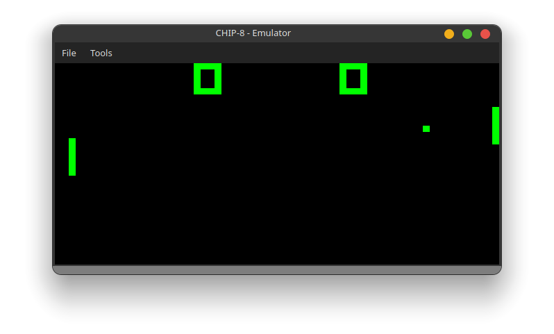

# CHIP-8 Emulator

A [CHIP-8](https://en.wikipedia.org/wiki/CHIP-8) emulator written in C++.

## Getting Started

This is a example of how you can build the application.

### Building

## Resources
[Multigesture](https://multigesture.net/articles/how-to-write-an-emulator-chip-8-interpreter/)
